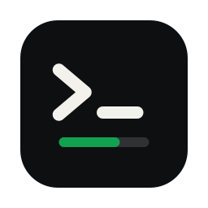
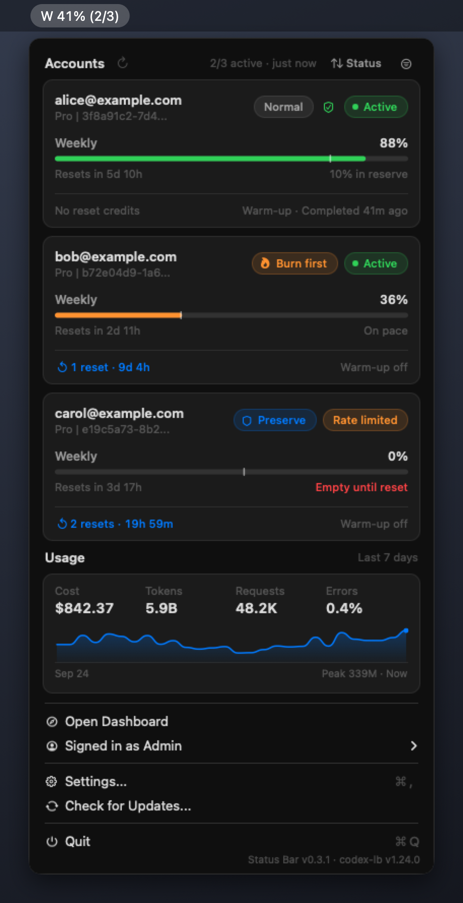

<p align="center">
  
</p>

<h1 align="center">Codex LB Status Bar</h1>

<p align="center">
  A native macOS menu bar app for <a href="https://github.com/Soju06/codex-lb">Codex LB</a>: account quota, pace, reset credits, and account controls without opening the dashboard.
</p>

<p align="center">
  <a href="https://github.com/sm1ee/codex-lb-statusbar/releases/latest"></a>
  
</p>

<p align="center">
  
</p>

## Install

```bash
brew install --cask sm1ee/tap/codex-lb-statusbar
```

Or download `CodexLBStatusBar-<version>.dmg` from the [latest release](https://github.com/sm1ee/codex-lb-statusbar/releases/latest) and drag the app to `Applications`.

On first launch:

1. The app is ad-hoc signed, not notarized, so macOS may block it. Open `System Settings > Privacy & Security` and choose `Open Anyway`.
2. Allow notifications when prompted.
3. The default server is `http://127.0.0.1:2455`. Change it in `Settings...` (⌘,) if Codex LB runs elsewhere, then sign in with `Admin Login...` or `Guest Login...`.

Requires macOS 13 or later and a running Codex LB server. After installing, the app updates itself.

## Features

**Menu bar**
- Average remaining quota (5h / weekly) as a usage bar and a token-usage sparkline (same data and style as the menu chart) — each an independent toggle; the app logo appears when both are off.
- Usage bar shapes: one rounded bar per window (5h, Weekly) stacked, the same with the first window's percent beside it, or one bar per account in a single row with the percent beside it — plain or with the email prefix above each bar (up to 10 accounts, then a `+N` overflow marker).
- Accounts can be ordered by usage (worst or best first), by name, or in server order.
- The average counts rate-limited and quota-exceeded accounts (usually 0%) and leaves out paused, re-auth-required, and deactivated ones, so it doesn't jump when an account runs dry.
- Colors: `Warnings Only` (default), `Full Color`, `Usage Only` (usage bar colored, text plain), or `Monochrome`. Each item can be hidden.
- `⌥⌘L` opens the menu from anywhere.

**Accounts**
- Status, routing policy, quota, reset timing, and pace per window (`On pace`, `N% in reserve`, `Runs out in …`), with an even-pace tick on each bar.
- Sort by status, remaining quota, soonest reset, or name, or show only accounts that need attention.
- Admin controls: pause/resume, cycle routing policy, and use a reset credit (with a confirmation showing which credit is used).
- Re-authenticate expired accounts from the status badge via browser OAuth (paste the callback URL for remote servers) or device code.
- Right-click a card to open it in the dashboard, copy email/ID, rename, toggle limit warm-up, or use a reset credit.

**Usage**
- Cost, tokens, requests, error rate, and a bar, line, or area token chart for the last 24 hours, 7 days, or 30 days.

**Alerts**
- Average quota below 30% / 10%.
- An account becomes re-auth-required or deactivated.
- Unused reset credits expire within 24 hours.
- A new Codex LB server release is available (prereleases too, with `Betas` enabled in Settings).

**App**
- Refreshes every 60 seconds. When the server is unreachable, the last data stays visible, dimmed, with its age.
- Theme follows the system or is forced to Light/Dark, with a brightness slider.
- Self-updates from GitHub Releases, and checks the connected Codex LB server for updates.
- Remembers the dashboard login in the macOS Keychain per server.

Guest sessions are read-only. Reset credits can't be used on paused, re-auth-required, or deactivated accounts (the same rule as the server).

## Security and privacy

- The app talks only to your Codex LB server and to GitHub (`api.github.com` for update checks and release downloads).
- Admin and password-protected guest passwords are stored in the macOS Keychain, keyed by server URL. Remove them with `Settings > Forget Saved Login`. TOTP is always prompted.
- Updates are installed only when the DMG's SHA-256 matches the digest GitHub publishes for the release asset, the bundle identifier and version match the release, and the code signature is valid. The app is ad-hoc signed, so this checks integrity, not publisher identity.
- Updating in place requires the app to run from a writable folder such as `/Applications`.
- Other preferences are stored in `UserDefaults` for the current user.

## How it works

- **Pace** uses the average burn rate since the window started. The tick marks where remaining quota would be at an even pace.
- **Quota alerts** fire once per threshold crossing and re-arm after the average recovers 5 points. Nothing is sent for the state seen at launch.
- **Browser re-authentication** relies on the Codex LB server's `localhost:1455` OAuth callback. If the server runs on another machine, paste the final callback URL into the app or use device code.
- **Server update checks** use the server's `/api/runtime/version`, and fall back to GitHub Releases on older servers (hourly; `Betas` in Settings also reports prereleases).

## Build

Requires the Xcode command line tools.

```bash
./build-dmg.sh                        # build/CodexLBStatusBar.app and dist/CodexLBStatusBar-<version>.dmg
swiftc StatusBarLogic.swift StatusBarLogicTests.swift -o /tmp/statusbar-logic-tests && /tmp/statusbar-logic-tests
packaging/homebrew/render-cask.sh     # cask for the built DMG
```

The version comes from `VERSION`.

| File | Purpose |
|---|---|
| `CodexLBStatusBar.swift` | Menu bar UI, settings window, API client, login, reset-credit and re-auth flows, notifications |
| `StatusBarLogic.swift` | Quota aggregation, pace, sorting, alert rules, version comparison, formatting |
| `StatusBarLogicTests.swift` | Logic checks |
| `AppUpdater.swift` | GitHub Releases self-updater |
| `GlobalHotKey.swift` | `⌥⌘L` shortcut |
| `build-dmg.sh` | App bundle, ad-hoc signing, DMG |
| `assets/make-icon.swift` | Renders `assets/AppIcon.icns` (delete the `.icns` to regenerate) |
| `packaging/homebrew/` | Homebrew cask template |
