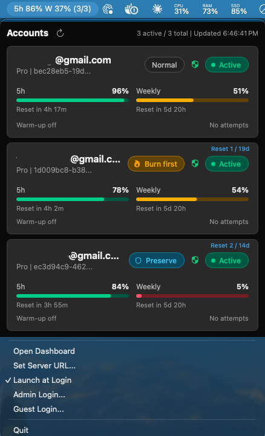

# Codex LB Status Bar

Current version: **v0.3.0**

Native macOS menu bar app for checking [Codex LB](https://github.com/Soju06/codex-lb) account availability and quota without opening the dashboard.



## Features

- Shows average remaining 5-hour and weekly quota in the menu bar, color-coded per window, with a red `!` when an account needs re-authentication. The average includes rate-limited and quota-exceeded accounts (usually 0%) and excludes paused, re-auth-required, and deactivated accounts.
- Sends macOS notifications when the average quota drops below 30% / 10% or an account becomes `Re-auth required`/`Deactivated` (toggle via `Notifications` in the menu).
- Displays account status, routing policy, quota, reset timing, and reset-credit expiry.
- Uses green, amber, and red quota/status warning levels matching the dashboard.
- Lets administrators toggle `Active`/`Paused` and cycle `Normal`, `Burn first`, and `Preserve` routing policies from account badges.
- Lets administrators redeem a reset credit from the `Reset N / …` indicator after a confirmation that shows which credit will be used.
- Lets administrators re-authenticate `Re-auth required`/`Deactivated` accounts from the status badge via browser OAuth (with callback-URL paste for remote servers) or device code.
- Refreshes every 60 seconds and supports immediate manual refresh.
- Supports admin/guest login, configurable server URL, dashboard access, and Launch at Login.
- Shows the connected Codex LB server version.

Account controls are read-only for guest sessions. Reset credits cannot be used on paused, re-auth-required, or deactivated accounts (same rule as the server).

## Install

1. Download `CodexLBStatusBar-0.3.0.dmg` from the [v0.3.0 release](https://github.com/sm1ee/codex-lb-statusbar/releases/tag/v0.3.0).
2. Open the DMG and drag `CodexLBStatusBar.app` to `Applications`.
3. Start Codex LB, then open the status bar app. The default server URL is `http://127.0.0.1:2455`.
   The app is ad-hoc signed, so on first launch macOS may block it; right-click the app and choose `Open`, or allow it in `System Settings > Privacy & Security`.
4. Allow notifications when prompted (or later in `System Settings > Notifications > Codex LB Status`).
5. Use `Admin Login...` or `Guest Login...` when authentication is required. Reset credits and re-authentication require an admin session.

Requires macOS 13 or later and a running Codex LB server.

## Build

Install Xcode command line tools, then run:

```bash
./build-dmg.sh
```

Outputs:

- `build/CodexLBStatusBar.app`
- `dist/CodexLBStatusBar-0.3.0.dmg`

Run the focused logic checks with:

```bash
swiftc StatusBarLogic.swift StatusBarLogicTests.swift -o /tmp/statusbar-logic-tests
/tmp/statusbar-logic-tests
```

## Runtime Notes

- The server URL and notification preference are stored in `UserDefaults` for the current macOS user.
- Quota notifications fire once per threshold crossing and re-arm after the average recovers 5 points above it; nothing is sent for the state seen at launch.
- Browser re-authentication relies on the Codex LB server's `localhost:1455` OAuth callback. When the server runs on another machine, paste the final callback URL into the app or use device code.
- `Launch at Login` uses the native macOS login-item service.
- Error and empty states are shown in English.

## Project Files

- `CodexLBStatusBar.swift`: menu bar UI, API client, dashboard login, reset-credit and OAuth re-auth flows, notifications, and login-item integration
- `StatusBarLogic.swift`: quota aggregation, status-bar title segments, alert thresholds, reset-credit gating, and formatting logic
- `StatusBarLogicTests.swift`: focused logic checks
- `build-dmg.sh`: versioned app bundle and DMG packaging
